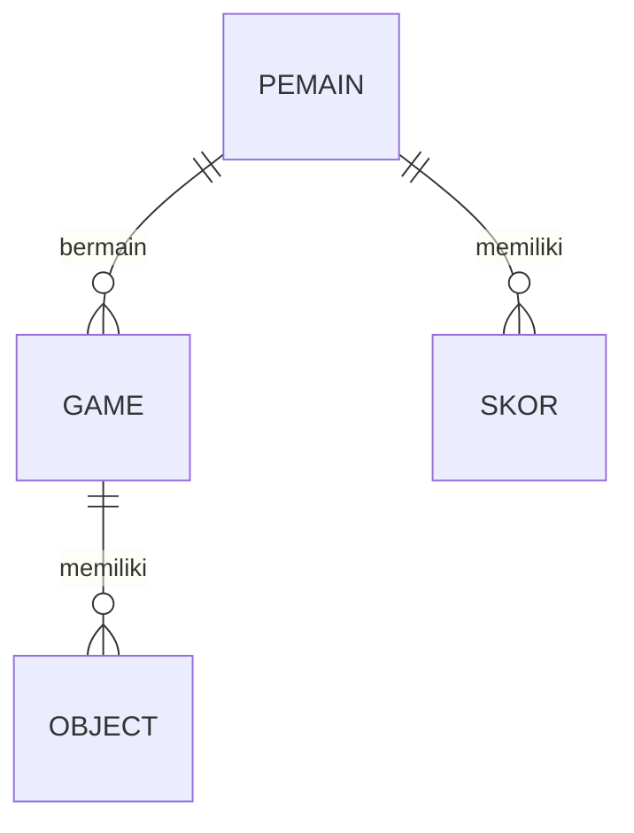
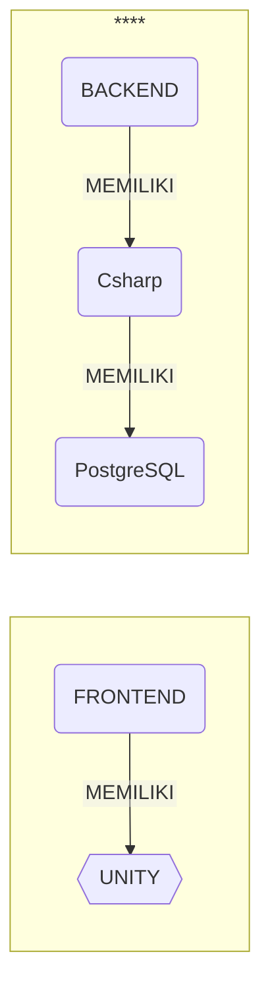

## 1.1 Latar Belakang
Latar belakang dari Game kuis edukasi ini adalah berawal dari ketertarikan saya terhadap dunia game,terutama pada  game edukasi,yang memiliki potensi besar untuk memberikan cara belajar yang menarik dan efektif, terutama bagi siswa sekolah dasar. Game kuis ini menurut saya sangat  menarik karena memungkinkan siswa memahami dan mengingat materi dengan cara yang lebih mudah dari pada metode pembelajaran di kelas.Game edukasi ini juga dapat meningkatkan kualitas pembelajaran terhadap pengetahuan para siswa-siswa ketika tidak berada di sekolah, saya bertujuan untuk membuat game yang tidak hanya mendidik tetapi juga menyenangkan. Saya berharap game yang saya buat akan menjadi sesuatu yang bermanfaat bagi guru dan siswa dalam proses pembelajaran mereka. Salah satu caranya adalah dengan membuat game kuis edukasi "JavaQuest" berbasis "  karena game ini tidak hanya memberikan cara yang menyenangkan untuk belajar, tetapi juga dapat membantu siswa memahami dan mengingat materi dengan cara atau penyampaian yang berbeda.

## 1.2. Deksripsi Teknologi Informasi
Teknologi informasi yang digunakan dalam game Kuis edukasi seperti perangkat lunak, antarmuka pengguna (UI), dan algoritma yang akan mendukung pengembangan game edukasi ini. 
Teknologi informasi yang digunakan dalam game ini berupa :
- Platform pengembangan utama game ini menggunakan IntelliJ IDEA
- Bahasa pemrograman yang digunakan adalah Java,
- Antarmuka pengguna grafis (GUI) dalam game ini dikembangkan menggunakan komponen Swing / AWT dari Java. Ini mencakup penggunaan elemen UI seperti JLabel, JButton, dan JRadioButton untuk    membangun tampilan permainan.

## 1.3. Branding
    
- NamaGame: JavaQuest
- Tagline : "Jelajahi,Pelajari,dan Nikmati'    
- Campaign: Game Edukasi yang Memikat Hati: JavaQuest    
- target user :    
  - Siswa 8+
  - Orang Tua
  - Guru

## 2. User Story 

Sebagai|yang dilakukan | Sehingga | prioritas
---|---|---|---
Seorang pemain baru | membuka game nya |  Bisa memainkan game ini | ⭐⭐⭐⭐⭐
Seorang pemain baru | memainkan game ini | Bisa menamatkan Game ini | ⭐⭐⭐⭐⭐
seorang pemain baru | menekan jawaban benar | Bisa Lanjut ke Soal berikutnya |⭐⭐⭐⭐⭐
Seorang pemain | memilih pilihan level kesulitan agar dapat menyesuaikan tantangan sesuai dengan tingkatanyya | permainan lebih menarik dan menantang |  ⭐⭐⭐⭐⭐
pembuat Game  |  menambahkan fitur penyimpanan progress sehingga bisa melanjutkan permainan dari level terakhir yang telah saya capai | pencapaian  terjauh dari sang pemain tersimpan | ⭐⭐⭐⭐⭐
pembuat Game  |  menambahkan  variasi pertanyaan sehingga setiap kali bermain, saya dapat menikmati pengalaman yang berbeda | pemain  tidak bosan memainkan game nya  | ⭐⭐⭐⭐⭐
pembuat game  | menambahkan sistem skor atau peringkat untukdibandingkan dengan pemain lainnya |  ada motivasi dari pemainlain untuk meningkatkan kemampuan | ⭐⭐⭐⭐⭐
pembuat game  | menambahkan antarmuka yang ramah pengguna agar bisa dengan mudah menjawab pertanyaan dalam game nya  | bermain gamenya  lebih nyaman | ⭐⭐⭐⭐⭐
pemain |  melihat petunjuk saat menemui pertanyaan yang sulit | tidak terjebak dalam satu level terlalu lama | ⭐⭐⭐⭐⭐
Pembuat Game | menambahkan video untuk membantu pemain yang kesusahan dalamlevel tertentu | agar pemin tidak terjebak dalam satu level terlalu lama | ⭐⭐⭐⭐⭐
Pembuat Game|  ingin menambhakan fitur ulang pertanyaan yang sudah dijawab | pemain bisa lebih memahami setiap level  yang dipelajari | ⭐⭐⭐⭐⭐
pemain | ingin melihat pertanyaan atau pun level yang sudah di selesaikan | pemain bisa lebih memahami setiap level  yang dipelajari |⭐⭐⭐⭐⭐
Pemain | yang dilakukan ingin adanya variasi desain level atau latar belakang untuk menjaga ketertarikan visual saat bermain | Sehingga permainan terasa lebih segar dan menarik | ⭐⭐⭐⭐⭐
## 3. Struktur Data

Cara membuat aneka macam bentuk grafik menggunakan mermaid.js bisa lihat di [https://mermaid.js.org/syntax/entityRelationshipDiagram.html](https://mermaid.js.org/syntax/entityRelationshipDiagram.html) 

 graph TD;
    FRONTEND --> UNITY;
    BACKEND --> Csharp;
    Csharp --> PostgreSQL;
## 4. Arsitektur Sistem

- Frontend adalah bagian dari aplikasi yang terlihat dan diakses oleh pengguna.
- Backend adalah bagian tersembunyi dari aplikasi yang bekerja di balik layar.

Masih pake mermaid.js juga bisa lihat flowchart di [https://mermaid.js.org/syntax/flowchart.html](https://mermaid.js.org/syntax/flowchart.html)

## 5. Teknologi, Library, dan Framework
- Unity Game Engine
- C# Programming Language
- studio code
## 6. Desain User Experience dan User Interface

Bisa load image 

## 7. Demonstrasi Video

Link youtube nya

## 8. Bagaimana mesin komputasi dan sistem operasi berperan dalam produk teknologi informasimu ?

Link youtube nya di detik jawaban ini

## 9. Bagaimana algoritma, struktur data, dan bahasa pemrograman berperan dalam produk teknologi informasimu ?

Link youtube nya di detik jawaban ini

## 10. Bagaimana metode pengembangan perangkat lunak / Software Development Life Cycle berperan dalam produk teknologi informasimu ?

Link youtube nya di detik jawaban ini

## 11. Bagaimana database / sistem basis data berperan dalam produk teknologi informasimu ?

Link youtube nya di detik jawaban ini
