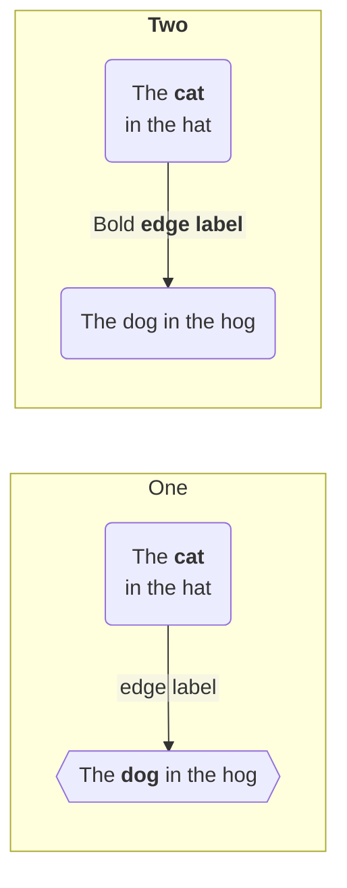

## 1.1 Latar Belakang
Latar belakang dari Game edukasi berbasis "drag and drop" adalah berawal dari ketertarikan saya terhadap dunia game,Game edukasi terutama game berbasis "drag and drop",yang memiliki potensi besar untuk memberikan cara belajar yang menarik dan efektif, terutama bagi siswa sekolah dasar. Game berbasis "drag and drop" menarik karena memungkinkan siswa memahami dan mengingat materi dengan cara yang lebih mudah dari pada metode pembelajaran di kelas.Game edukasi ini juga dapat meningkatkan kualitas pembelajaran terhadap pengetahuan para siswa-siswa ketika tidak berada di sekolah, saya bertujuan untuk membuat game yang tidak hanya mendidik tetapi juga menyenangkan. Saya berharap game yang saya buat akan menjadi sesuatu yang bermanfaat bagi guru dan siswa dalam proses pembelajaran mereka. Salah satu caranya adalah dengan membuat game edukasi "Belajar bareng si DD" berbasis "drag and drop"  karena game ini tidak hanya memberikan cara yang menyenangkan untuk belajar, tetapi juga dapat membantu siswa memahami dan mengingat materi dengan cara atau penyampaian yang berbeda.

## 1.2. Deksripsi Teknologi Informasi
Teknologi informasi yang digunakan dalam game edukasi berbasis "drag and drop" seperti perangkat lunak, antarmuka pengguna (UI), dan algoritma yang akan mendukung pengembangan game edukasi ini. 
Teknologi informasi yang digunakan dalam game ini berupa :
- Platform Pengembangan Game berupa Unity.
- Bahasa Pemrograman yang di gunakan berupa C# bahasa pemrograman yang biasa digunakan saat mengembangkan game dengan Unity.
- Desain Grafis dan Animasi yang berupa Aset permainan seperti karakter, latar belakang, dan objek grafis lainnya.

## 1.3. Branding
    
- NamaGame: Belajar Bareng Si DD   
- Tagline : Ambil dan Letakkan Pengetahuanmu Sekarang    
- Campaign: Jelajahi Dunia Belajar yang baru dengan Game Seru Berbasis Ambil dan Letakkan    
- target user :    
  - Siswa 6+
  - Orang Tua
  - Guru

## 2. User Story 

Sebagai|yang dilakukan | Sehingga | prioritas
---|---|---|---
Pengguna : seorang siswa kelas 4 sd dan ingin memahami nama nama pelanet dalam tata surya| Membuka game dan menyelesaikan game nya  | sisiwa trsebut dapat mengetahui nama nama pelanet dan tata letaknya di tata surya| ⭐⭐⭐⭐⭐
Pengguna : Seorang anak yang ingin belajar tentang warna-warna dasar |	Menjalankan game dan menyelesaikn game tentang warna warna dasaar | Mengenal dan mengingat nama-nama warna dengan lebih baik| ⭐⭐⭐⭐⭐
Pengguna : Siswa Kelas 1 yang ingin mengetahui nama nama presiden indonesia | membuka game dan menyelesaikan game nya | siswa tersebut dapat mengetahui nama nama presiden dan melihat foto fotonya | ⭐⭐⭐⭐⭐
Pengguna : Orang tua yang ingin membantu anaknya untuk mengenal sistem pencernaan pada manusia | membuka dan menyelesaikan game tentang pencernaan pada manusia | orang tua dapat memberikan beberapa pesan kepada anaknya untuk menjaga kesehatan pencernaaanyya|  ⭐⭐⭐⭐⭐
Pengguna : Guru Bahasa inggris yang ingin melihat kemampuan para muridnya dalam menguasai kosakata bahasa inggris | membuka dan menyelesaikan game tentan kosakata  bahsa inggrisnya | guru dapat mengetahui sejauh mana muridnya mengetahui kosakata bahasa inggrisnya|  ⭐⭐⭐⭐⭐

## 3. Struktur Data

Cara membuat aneka macam bentuk grafik menggunakan mermaid.js bisa lihat di [https://mermaid.js.org/syntax/entityRelationshipDiagram.html](https://mermaid.js.org/syntax/entityRelationshipDiagram.html) 

 graph TD;
    FRONTEND --> UNITY;
    BACKEND --> Csharp;
    Csharp --> PostgreSQL;
## 4. Arsitektur Sistem

- Frontend adalah bagian dari aplikasi yang terlihat dan diakses oleh pengguna.
- Backend adalah bagian tersembunyi dari aplikasi yang bekerja di balik layar.

Masih pake mermaid.js juga bisa lihat flowchart di [https://mermaid.js.org/syntax/flowchart.html](https://mermaid.js.org/syntax/flowchart.html)

## 5. Teknologi, Library, dan Framework
- Unity Game Engine
- C# Programming Language
- studio code
## 6. Desain User Experience dan User Interface

Bisa load image 

## 7. Demonstrasi Video

Link youtube nya

## 8. Bagaimana mesin komputasi dan sistem operasi berperan dalam produk teknologi informasimu ?

Link youtube nya di detik jawaban ini

## 9. Bagaimana algoritma, struktur data, dan bahasa pemrograman berperan dalam produk teknologi informasimu ?

Link youtube nya di detik jawaban ini

## 10. Bagaimana metode pengembangan perangkat lunak / Software Development Life Cycle berperan dalam produk teknologi informasimu ?

Link youtube nya di detik jawaban ini

## 11. Bagaimana database / sistem basis data berperan dalam produk teknologi informasimu ?

Link youtube nya di detik jawaban ini
